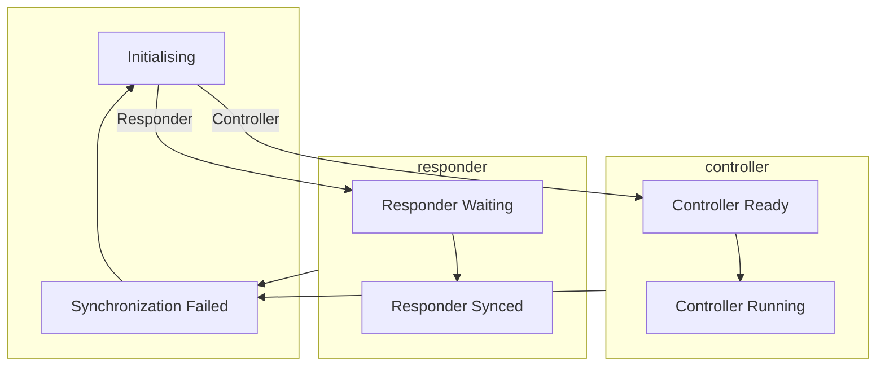

# Telescope & Site VMS FPGA

This is code for FPGAs loaded into cRIO FPGAs. Handles low-level tasks of
recording data into FPGA FIFOs. [TS VMS](https://github.com/lsst-ts/ts_vms) is
a CSC, asking FPGA for data and making those available as SAL/DDS messages.

The code provides various build target to build FPGA for different cRIOs
collecting FPGA data.

FPGA operates similarly to [M1M3 SS
FPGA](https://github.com/lsst-ts/ts_m1m3supportfpga). 

## Timestamp format

Timestamp is stored in unsigned 64 bit integer. The first 44 bits are seconds
(ctime, TAI). Last 20bits are us (microseconds).

## User LED

FPGA user LED on chassis shall switches on/off every 1000 samples requested
through request 1.

## FPGA Operation

cRIOs can have arbitrary number of NI-9234 units, digitizing accelerometers
output voltage to get acceleration.

Commands are written to Command FIFO. The following commands are supported:

| Command | Description                                          |
| ------- | ---------------------------------------------------- |
| 1       | Turn on/off (Start/Stop) Accelerometers.             |
| 2       | Set internal time.                                   |

Command to start/stop accelerometers is followed either by 0 (stop) or 1
(start). Command to set internal time is followed by 4 16bit numbers,
representing current time in big endian, timestamp format.

Following commands are accepted on Request FIFO. Those are used to request data
from internal FIFOs:

| Command | Description                                          |
| ------- | ---------------------------------------------------- |
| 1       | Request accelerometer data.                          |
| 3       | Request chassis temperature.                         |

### Response to command 1

:warning: Before reading data, you shall:

1. synchronize FPGA clocks (command 2)
2. start accelerometers (command 1)

The process requesting data shall regularly call command 2 to synchronize
clocks as it reads data. Those are internal FPGA clocks, doesn't affect readout
frequency - it is used only for timestamping samples.

First data might took longer to arrive - expecting 500ms timeout is reasonable.
Next data shall come in 50ms (50 samples at 1kHz), 70ms is reasonable. Data are
cached in FIFO (~1000 samples).

- 50 timestamps on U64ResponseFIFO.
- 50 * 3 * [number of accelerometers] double values (raw accelerometer values) on SQLResponseFIFO.

### Response to command 3
- 1 U64 value on U64ResponseFIFO, representing chassis temperature in C * 100.

Chassis temperature is measured with 0.25 degC resolution.

## cRIO modules settings

NI-9234 and NI-9232 should be configured for calibrated mode. The DIO modules
clocks on single cRIO shall be synchronized to single time source - currently
the first DIO module, in future NI-9469 sync. This is required to read all DIOs
at the same time.

## Timestamp synchronization

Timing of retrieved data, and particularly synchronization among different data
stream, is critical for this application. With incorrect time, data cannot be
easily correlated among different sources.

cRIOs are equipped with NI-9469 synchronization module. One of the VMS cRIOs
is designated as source of the synchronization signals, generating triggers at
regular intervals. This source cRIO is referred to as controller in the
following paragraphs. The other cRIOs are designated as responders. Responders
receive clock triggers from the controller. NI-9469 provides 4 trigger lines,
which are used as following:

| Line | Used for                                                                                                                       |
| ---- | ------------------------------------------------------------------------------------------------------------------------------ |
| 0    | Triggered for controller-responder synchronization. Data shall be averaged out, base clock increased when this trigger occurs. |
| 1    | Send from controller to responder to zero base clocks, start accelerometer collecting.                                           |
| 2    | Not used.                                                                                                                      |
| 3    | Not used.                                                                                                                      |

To synchronize clocks, master shall establish (and re-establish) base clocks.
Base clocks offset to TAI is then published in the "baseClockOffset" field of
the "timeSynchronization" event.

### Time synchronization state machine

CSC time synchronization state is held in "state" field of the
"timeSynchronization" event.

### Initialising state

CSC is started in initialising state. In this state, controller sets base
clocks to 0 and doesn't send time synchronization triggers. A thread to receive
timeSynchronization events is started in controller before transitioning to
Controller Ready state.

Receivers sets base clock to 0. A thread to receive timeSynchronization events
from controller (CSC with index 1) is started before transitioning into
Responder Waiting state.

### Responder Waiting state

In this state, responder is ready to receive controller clocks. Once base clock
zero trigger (line 1) is received and base clock offset from controller with
"Controller Running" state transitions are received, responder switch to state
Responder Synced.

If responder cannot switch to Responder Synced within some timeout, it fails to
"Synchronization Failed" state.

### Responder Synced state

In this state, responder is receiving triggers on line 0. That triggers data
readout.

### Controller Ready state

Controller checks for state received from responders (CSC with index > 0). If
Initialising is received, it noticed responder and wait for it to reach
Responder Waiting state. When at least a configurable number of responders are
in "Responder Waiting" state, controller triggers Base Zero Clock (line 1), and
transition into Controller Running state. The event issued with transition to
Controller Running state includes current baseClockOffset value.

In a special case, when running with 0 required responders, controller just
transition into Controller Running state.

### Controller Running state

Regular triggers on line 0 are send out by the controller to receivers. The
same triggers are used within controller cRIO to readout its accelerometer
values.

Controller also process state transition of responders from "Responder Waiting"
into "Responder Running". Those events baseClockOffset are compared with
controller base clock offset, and if mismatch is detected, controller fails
into Synchronization Failed state.

Controller also fails into Synchronization Failed state if any responder which
entered "Responder Waiting" state doesn't progress into "Responder Running", or
if a CSC enters "Synchronization Failed" or "Initializing" states.

### Synchronization Failed state

Controller should switch to this state either on baseClockOffset mismatch among
CSC, timeout while waiting for know responders to progress into Responder
Synced state, or when any responder transition into Synchronization Failed
state. 

Responder should switch to this state if triggers on line 0 aren't received for
given multiply of expected intervals. Of course responder switch to this state
when controller switch to this state.

Once received, controller CSC shall stop sending triggers, and both controller
and responder CSC shall stop measuring loop. After given time delay, the CSC
transitions into initialising state.

This state can be used by a CSC to force base offset resets and time
synchronization.

## Data processing

Running statistics (mean, average,  minimal, maximal values) is calculated with
every new sample, acquired from AD converter. Individual readout values are
also stored in the memory, allowing calculation of mean, if needed.

## CameraRotator FPGA

As Camera Rotator uses NI-9076 cRIO VxWorks RTOS, C++ based Linux CSC cannot be
run directly on CPU attached to FPGA. FPGA can be commanded through Ethernet,
with RIO name specified as URL (rio://<ip-address>/RIO). Please see [TS VMS
configuration](https://github.com/lsst-ts/ts_vms/master/SettingFiles/CameraRotator/VMSApplicationSettings.yaml)
for details.
